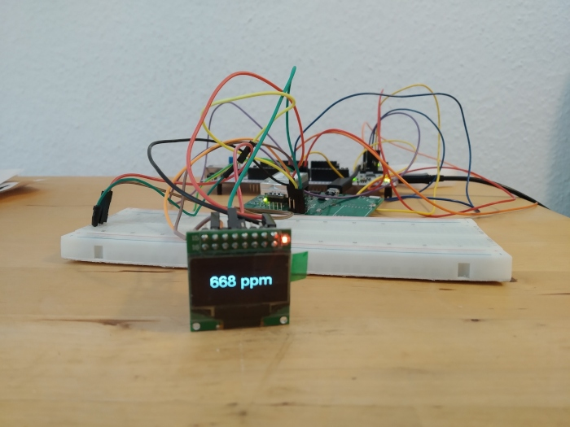

# air-quality-stm32

The purpose of this project is to continously measure air quality by reading a Sensair S8 CO2 sensor and displaying the value on an OLED.
It uses CMake as the build system.

## Dependencies
* [CMake for STM32](https://github.com/ObKo/stm32-cmake)
* [u8g2](https://github.com/olikraus/u8g2) (using a custom CMakeLists - see u8glib directory)
* STM32F4 HAL

## Hardware
* custom board
* SSD1306 128x64 OLED is connected via I2C
* pins for the sensor and display are defined in the _hw.h headers

## Images
